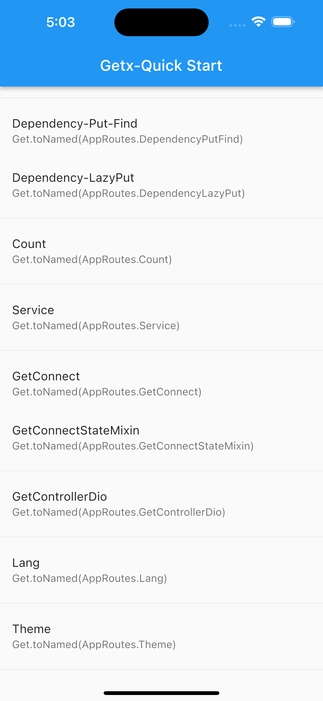
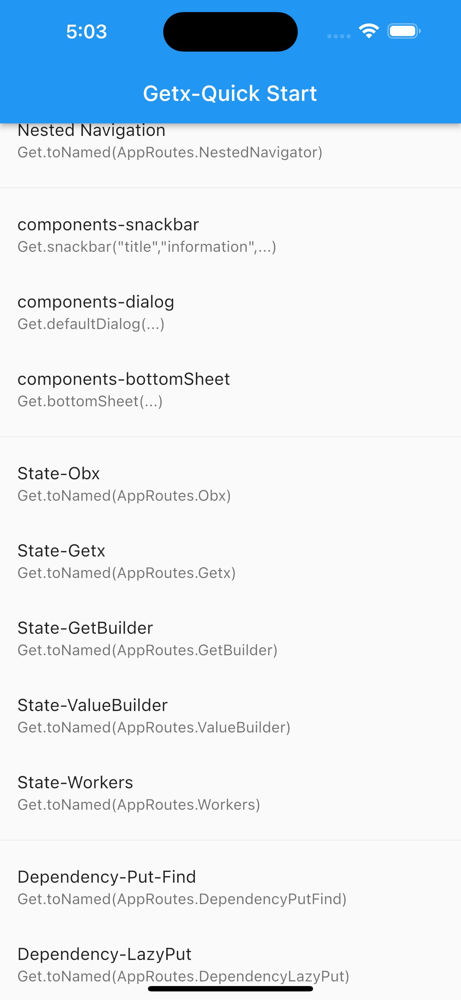

# getx_quick_start

## reference

- getx pub
  https://github.com/jonataslaw/getx

- getx cli
  https://marketplace.visualstudio.com/items?itemName=get-snippets.get-snippets

- getx pattern
  https://kauemurakami.github.io/getx_pattern/

## Fully enable getx4 + null-safety null safety

## foreword

This repository is only for sorting and researching the getx function. The actual project code structure is not implemented here (may use getx to rewrite a version of last year's news client APP).
## research focus

1. function coverage
2. Three-terminal performance: android ios, web, desktop

## official warehouse

https://pub.flutter-io.cn/packages/get

## development environment

- Flutter 2.1.0-12.1.pre
- Dart 2.13.0
- get: ^4.1.3

## reference

- [Sound null safety](https://dart.dev/null-safety)
- [getx_pattern](https://kauemurakami.github.io/getx_pattern/)
